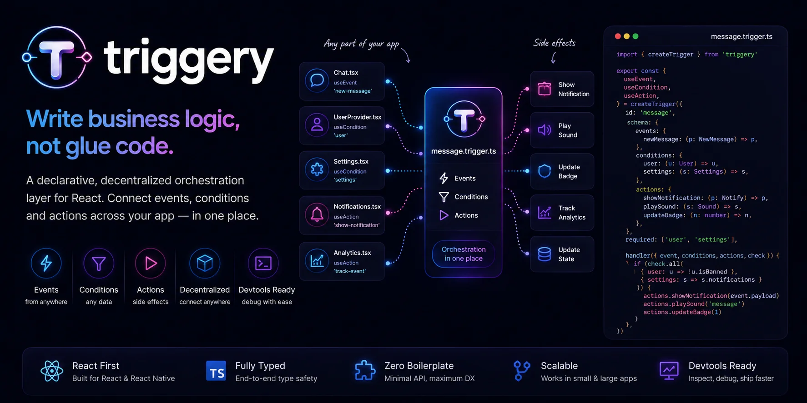

<p align="center">
  
</p>

# Triggery

> **Write business logic, not boilerplate.**

[](https://github.com/triggeryjs/triggery/actions/workflows/ci.yml)
[](https://codspeed.io/triggeryjs/triggery?utm_source=badge)
[](https://deepwiki.com/triggeryjs/triggery)
[](https://www.npmjs.com/package/@triggery/core)
[](https://bundlejs.com/?q=%40triggery%2Fcore)
[](https://www.npmjs.com/package/@triggery/core)
[](./LICENSE)
[](https://github.com/triggeryjs/triggery/stargazers)
[](https://www.patreon.com/triggery)
[](https://boosty.to/triggery)
[](https://github.com/triggeryjs/triggery/discussions)

**Not an event emitter. Not a state manager. Triggery orchestrates business logic across your app.**

A declarative, hook-first coordination layer for React: **event → conditions → actions** in one file. State lives in your store of choice (Zustand, Redux, Jotai, MobX, signals — anything). Events come from anywhere (WebSockets, DOM, your UI). Triggery sits between them and decides *when* to do *what*, *if* the world is in the right shape.

## Example: "show a toast for incoming messages, with sound, unless I'm already on that channel"

### 1. The scenario lives in one file

```ts
// triggers/message.trigger.ts
import { createTrigger } from '@triggery/core';

export const messageTrigger = createTrigger<{
  events: {
    'new-message': { author: string; text: string; channelId: string };
  };
  conditions: {
    user: { id: string; name: string };
    settings: { sound: boolean; notifications: boolean };
    activeChannelId: string | null;
  };
  actions: {
    showToast: { title: string; body: string };
    playSound: 'beep' | 'mod-alert';
  };
}>({
  id: 'message-received',
  events: ['new-message'],
  required: ['user', 'settings'],
  handler({ event, conditions, actions, check }) {
    if (!conditions.user || !conditions.settings) return;

    // Don't notify about the channel I'm currently looking at.
    if (conditions.activeChannelId === event.payload.channelId) return;

    // Don't notify for my own messages.
    if (event.payload.author === conditions.user.name) return;

    if (!check.is('settings', (s) => s.notifications)) return;

    actions.showToast?.({
      title: event.payload.author,
      body: event.payload.text,
    });

    if (check.is('settings', (s) => s.sound)) {
      actions.playSound?.('beep');
    }
  },
});
```

### 2. UI components only provide ports — they know nothing about each other

```tsx
// auth/UserProvider.tsx — supplies "who I am"
useCondition(messageTrigger, 'user', () => currentUser, [currentUser]);

// settings/SettingsProvider.tsx — supplies notification preferences
useCondition(
  messageTrigger,
  'settings',
  () => ({ sound: prefs.sound, notifications: prefs.notifications }),
  [prefs.sound, prefs.notifications],
);

// chat/ActiveChannelTracker.tsx — supplies which channel is in focus
useCondition(messageTrigger, 'activeChannelId', () => currentChannelId, [currentChannelId]);

// chat/Chat.tsx — emits the event when a WS message arrives
const fire = useEvent(messageTrigger, 'new-message');
useEffect(() => socket.on('msg', fire), [fire]);

// notifications/Toast.tsx — knows how to render a toast
useAction(messageTrigger, 'showToast', ({ title, body }) =>
  toast.success(title, { description: body }),
);

// notifications/SoundPlayer.tsx — knows how to play a sound
useAction(messageTrigger, 'playSound', (kind) => audioBus.play(kind));
```

Six files, one scenario, no prop drilling, no `useEffect` chains, no central thunk/saga. The trigger reads like a spec.

## Install

> Pre-1.0: the API is unstable; minor versions may introduce breaking changes.

```bash
pnpm add @triggery/core @triggery/react
```

## Documentation

The full documentation site is at **<https://triggeryjs.github.io>** — Guide, Recipes (React / Solid / Vue), API reference for every public symbol, Packages catalogue, Migration cookbooks (from `useEffect`, RTK listenerMiddleware, Redux Saga, redux-observable), and the Contributing handbook.

The site is built with Astro Starlight under [`apps/docs/`](./apps/docs) and deployed by GitHub Pages on every push to `main`.

## Try it in 5 seconds

A runnable Vite + React example lives in [`examples/vite-react-counter`](./examples/vite-react-counter). Open it without cloning:

[](https://stackblitz.com/github/triggeryjs/triggery/tree/main/examples/vite-react-counter)
[](https://codesandbox.io/p/github/triggeryjs/triggery/main?path=%2Fexamples%2Fvite-react-counter)

**Try it without installing:**

[](https://stackblitz.com/github/triggeryjs/triggery/tree/main/examples/vite-notifications)
[](https://codesandbox.io/p/github/triggeryjs/triggery/main?file=examples/vite-notifications/src/triggers/message.trigger.ts)
[](https://codespaces.new/triggeryjs/triggery)

> Examples folder is populated as part of the [0.4 milestone](./ROADMAP.md). Until then the buttons drop you into the monorepo source so you can poke at the code.

## Packages

### Core

| Package | Description |
|---|---|
| [`@triggery/core`](./packages/core) | Runtime: `createTrigger`, `createRuntime`, indexed dispatch, inspector, middleware, `graph()` |
| [`@triggery/testing`](./packages/testing) | `createTestRuntime`, `mockCondition`, `mockAction`, `flushMicrotasks` |
| [`@triggery/vite`](./packages/vite) | Vite plugin: auto-imports every `*.trigger.ts` via a virtual module + HMR |

### Framework bindings

Same `useEvent` / `useCondition` / `useAction` API across all three. Pick the one for your framework — Triggery itself is framework-agnostic.

| Package | Description |
|---|---|
| [`@triggery/react`](./packages/react) | React bindings: `useEvent`, `useCondition`, `useAction`, `useInlineTrigger`, `useInspectHistory`, `createNamedHooks`, `<TriggerRuntimeProvider>`, `<TriggerScope>` |
| [`@triggery/solid`](./packages/solid) | SolidJS bindings — same API, native to signals + `onCleanup` |
| [`@triggery/vue`](./packages/vue) | Vue 3 bindings — same API, `provide`/`inject` + `onScopeDispose` |

### Adapters

Bridge any store / signal / atom into a Triggery condition without subscribing the host component to updates.

| Package | Description |
|---|---|
| [`@triggery/zustand`](./packages/zustand) | `useZustandCondition(trigger, name, store, selector)` |
| [`@triggery/redux`](./packages/redux) | `useReduxCondition(trigger, name, store, selector)` |
| [`@triggery/jotai`](./packages/jotai) | `useJotaiCondition(trigger, name, store, atom, selector?)` |
| [`@triggery/mobx`](./packages/mobx) | `useMobxCondition(trigger, name, () => observable)` — no dependency tracking on the host |
| [`@triggery/reatom`](./packages/reatom) | `useReatomCondition(trigger, name, atom, selector?)` (Reatom v1000+) |
| [`@triggery/signals`](./packages/signals) | `useSignalCondition(trigger, name, signal, selector?)` — `@preact/signals-core`, `alien-signals`, any `peek()` / `.value`-shaped signal |
| [`@triggery/query`](./packages/query) | `useQueryCondition(trigger, name, queryClient, queryKey, selector?)` — TanStack Query cache |

Pipe events from outside React into triggers:

| Package | Description |
|---|---|
| [`@triggery/dom`](./packages/dom) | `useDomEvent`, `useResizeObserver`, `useIntersectionObserver` |
| [`@triggery/socket`](./packages/socket) | `useSocketIoEvent` (socket.io-client), `useWebSocketEvent` (native WebSocket) |

### DevTools

| Package | Description |
|---|---|
| [`@triggery/devtools-redux`](./packages/devtools-redux) | Middleware that streams runtime events into the Redux DevTools browser extension |
| [`@triggery/devtools-panel`](./packages/devtools-panel) | Drop-in React components for in-app inspection — `<InspectorView>`, `<TriggerSnapshotView>` |
| [`@triggery/devtools-bridge`](./packages/devtools-bridge) | `installDevtoolsBridge(runtime)` — page-side bridge for external inspectors (Chrome ext, standalone panel) |

| Extension | Description |
|---|---|
| [`extensions/chrome-devtools`](./extensions/chrome-devtools) | Chrome DevTools panel — live inspector over `@triggery/devtools-bridge`. Load unpacked, see runs in a dedicated panel. |

### Tooling

| Package | Description |
|---|---|
| [`@triggery/eslint-plugin`](./packages/eslint-plugin) | ESLint 9 flat-config plugin. Eight rules covering `no-event-cascade`, `no-dynamic-id`, `hook-rules`, exhaustive-required/conditions, handler/port-count budgets, and named-hook suggestions. `recommended` and `strict` presets. |
| [`@triggery/codemod`](./packages/codemod) | ts-morph powered codemods: `extract-trigger` (pull a useEffect block into a `*.trigger.ts` file) and `migrate-from-listener-middleware` (one trigger per RTK `startListening` registration). CLI and programmatic API. |
| [`@triggery/cli`](./packages/cli) | `triggery create / scaffold / graph / lint`. Downloads starters from `templates/*` via giget, scaffolds new trigger files, prints the trigger graph as JSON / DOT / Markdown, and shims `eslint` with the recommended preset. |

### Project starters

```bash
pnpm dlx @triggery/cli create my-chat --template vite-react
pnpm dlx @triggery/cli create my-app --template next-app
pnpm dlx @triggery/cli create my-rn-app --template react-native
```

| Starter | Stack |
|---|---|
| [`templates/vite-react`](./templates/vite-react) | Vite 7 + React 19 + Triggery. Minimal "Greet" scenario across three components. |
| [`templates/next-app`](./templates/next-app) | Next.js 15 (App Router) + React 19 + Triggery, with a `'use client'` provider boundary. |
| [`templates/react-native`](./templates/react-native) | Expo SDK 52 + React Native 0.76 + Triggery. Same hook-API as web, no DOM. |

## Why

Business logic of the form _"when X happens, do Y if Z is true"_ is currently spread across `useEffect`, sagas, observable middleware, listener middleware and thunks. Symptoms:

* Prop-drilling of callbacks; ad-hoc contexts just to make one component call another.
* Side-effects glued to UI components.
* A single scenario ("message arrived → not the active channel → badge + sound + toast") scattered across three features.
* No way to see at a glance _what will happen when X occurs_.

Triggery's answer: **a scenario is one file**. The file reads like a spec.

## Performance

Measured on CodSpeed CPU-simulation runners (deterministic cycle counts, not wall-time). Reproducible via `pnpm bench`.

| Scenario | Throughput |
|---|---:|
| `fireEvent` with no registered triggers (baseline) | **27.6M ops/sec** |
| Single trigger, 0 conditions, 1 action | **634k ops/sec** |
| 10 triggers, each with 2 conditions and 1 action | **44k ops/sec** |

Bench source: [`benchmarks/bench/core/dispatch.bench.ts`](./benchmarks/bench/core/dispatch.bench.ts). Live dashboard: [codspeed.io/triggeryjs/triggery](https://codspeed.io/triggeryjs/triggery). Two suites are published: **`core`** (Triggery's own dispatch hot path) and **`vs`** (side-by-side with effector/rxjs/redux-saga/xstate).

### vs effector / rxjs / redux-saga / xstate / Reatom / MobX

Ten scenarios bench-ed against six neighbour libraries. Headline numbers (local M1 Pro, ops/sec; **bold = winner per row**). Triggery column shows the production default (`createRuntime({ inspector: false })`); the dev-default with the inspector on runs ~10-15% slower across most rows. Both modes appear side-by-side in [`benchmarks/COMPARISONS.md`](./benchmarks/COMPARISONS.md).

| Scenario | Triggery | effector | rxjs | saga | xstate | reatom | mobx |
|---|---:|---:|---:|---:|---:|---:|---:|
| Plain dispatch | 606k | 370k | **16.8M** | 428k | 675k | 3.78M | 3.02M |
| Conditional (50% pass) | 649k | 566k | **14.5M** | 484k | 1.29M | 4.45M | 3.24M |
| Cascade A → B | 335k | 356k | **9.91M** | 202k | 429k | 5.10M | 1.60M |
| Take-latest cancellation | 301k | 226k | **4.16M** | 381k | 50k | 3.32M | 497k |
| Sparse bus (100 types, fire 1) | 690k | **5.05M** | 388k | 327k | 795k | **5.07M** | 2.94M |
| Lazy conditions (5 sources, read 1) | 659k | 212k | **2.45M** | 316k | 122k | 1.19M | 2.00M |
| Multi-event single trigger | 694k | 3.75M | **14.3M** | 410k | 636k | 3.09M | 2.48M |
| Toggle enable/disable + fire | 1.21M | 528k | **6.48M** | 302k | 474k | 2.81M | 2.35M |
| Realistic app bus (30 events × 30 triggers + condition + action) | 586k | 361k | 1.29M | 440k | 703k | **4.26M** | 3.00M |
| Lazy conditions at scale (10 sources, read 1 rotating) | 625k | 160k | **1.43M** | 310k | 72k | 634k | 1.63M |

#### How to read this table

**Triggery is not an event emitter or a state manager** — it's an orchestrator that sits on top of whichever store you already have. The five state/effect/atom libraries in the table all out-throughput Triggery on raw per-fire cost, which is exactly what you'd expect: a `Subject.next()` (rxjs), an `atom.set()` (Reatom) or a `box.set()` (MobX) are bare reactive primitives, while every Triggery fire also runs the inspector ring buffer, cascade context, required-gate, lazy condition proxy, abort controller bookkeeping and middleware chain. **That overhead is the product, not a bug.**

Where Triggery still pulls ahead despite the overhead: **scenario 5** (indexed dispatch beats rxjs by ~1.8× and saga by ~2× — though effector and Reatom hold the top of this one together at ~5M each), **scenarios 6 + 10** (pull-only conditions beat effector, saga, and xstate by 2-8×; scenario 10 also lands tied with Reatom), **scenario 8** (first-class enable/disable beats effector, saga and xstate by 2-4×).

Full breakdown + idiomatic implementations + per-scenario analysis in [`benchmarks/COMPARISONS.md`](./benchmarks/COMPARISONS.md).

## Status

Pre-1.0 — public API can still change between minor versions. Roadmap to 1.0 lives in [`ROADMAP.md`](./ROADMAP.md). High-level milestones are tracked on the [GitHub Project board](https://github.com/orgs/triggeryjs/projects).

## Community

- [**GitHub Discussions**](https://github.com/triggeryjs/triggery/discussions) — questions, ideas, show-and-tell. Primary community channel until 1.0.
- **Discord** — opening at the 1.0 release. Until then async Discussions is the place.
- **X / Twitter** — [`@triggeryjs`](https://x.com/triggeryjs) (reserved, posts after 0.4 milestone).
- **Bluesky** — [`@triggeryjs.bsky.social`](https://bsky.app/profile/triggeryjs.bsky.social) (reserved).
- **Stack Overflow** — tag your question with [`triggery`](https://stackoverflow.com/questions/tagged/triggery).

See [`SUPPORT.md`](./SUPPORT.md) for the full "where do I ask X" guide.

## Contributing

PRs, RFCs, bug reports and documentation fixes are all welcome. Start here:

- [`CONTRIBUTING.md`](./CONTRIBUTING.md) — dev setup, workflow, coding standards, changesets.
- [`CODE_OF_CONDUCT.md`](./CODE_OF_CONDUCT.md) — Contributor Covenant 2.1.
- [`GOVERNANCE.md`](./GOVERNANCE.md) — how decisions are made.
- [`SECURITY.md`](./SECURITY.md) — responsible disclosure for security issues.
- [Good first issues](https://github.com/triggeryjs/triggery/issues?q=is%3Aissue+is%3Aopen+label%3A%22good+first+issue%22) — direct CTA if you want a small win.

Looking for something larger? Pick from [`ROADMAP.md`](./ROADMAP.md) or open an [RFC issue](https://github.com/triggeryjs/triggery/issues/new?template=rfc.yml).

## Sponsors

Triggery is built in the open and is free under the MIT licence. If your team relies on it, please consider sponsoring — it directly funds maintenance, docs, and the bug-bounty programme.

- **Patreon** (international) — <https://www.patreon.com/triggery>
- **Boosty** (RU/CIS-friendly) — <https://boosty.to/triggery>

> GitHub Sponsors is intentionally omitted — it is not available to the maintainer's region. Patreon is the international channel.

Corporate sponsors get a logo here once the programme launches. Reach out at `a@skhom.ru` with subject `[triggery sponsorship]`.

## Contributors

<a href="https://github.com/triggeryjs/triggery/graphs/contributors">
  
</a>

Pull requests, bug reports, and design feedback are all welcome — see [`CONTRIBUTING.md`](./CONTRIBUTING.md) for setup, workflow, and the RFC process for larger proposals. The contributor mosaic above is generated by [contrib.rocks](https://contrib.rocks) and auto-refreshes whenever the contributors list changes — no workflow, no PRs, just a CDN that follows the repo.

## License

MIT &copy; Aleksey Skhomenko — see [`LICENSE`](./LICENSE).
